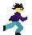
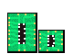
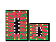

# Debug Dash

## Mūsų projekto komandos nariai
Kauno Technologijos Universiteto Informatikos fakulteto studentai (grupė IFZ-3/3):

- Požerskas Saulius
- Vilnius Martynas
- Arnas Šaltupis
- Paulauskis Deividas

## Projekto aprašymas
Debug Dash yra 2D begalinio bėgimo žanro žaidimas, kuriame žaidėjo tikslas yra išgyventi kuo įmanoma ilgesnį laiką neatsitrenkiant į kliūtis, nes bent vienas atsitrenkimas į kliūtį reiškia automatinę žaidėjo mirtį. Žaidimo metu taip pat žaidėjas renka bonusus, kurie padeda ilgiau išgyventi ir auksines monetas, kurias galima keisti į prekes žaidimo parduotuvėje. Žaidimo sudėtingumas didėja bėgant laikui.

## Techninis aprašymas

Žaidimas buvo sukurtas pasinaudojus Unity žaidimų kūrimo įrankiu. Projekto valdymui ir komandos darbui buvo pasitelktos priemonės: „JIRA“, „Discord“, „Unity Version Control“. Pasiekti pagrdindiniai techniniai tikslai žaidimo kūrimo metu (ne eilės tvarka):

- Sukurti begalinį takelio generavimą
- Suprogramuoti veikėjo UI
- Priskirti žaidimui muziką ir kitus garso efektus
- Priskirti žaidimui vaizdinius efektus, bėgimo, mirties, šuolio, pritūpimo animacijas
- Suprogramuoti Box Collider veikimo ypatumus su kliūtimis ir bonusais
- Sukurti veikėjų, kliūčių, bonusų vaizdus
- Suprogramuoti taškų skaičiavimo ir bonusų veikimo sistemą
- Suprogramuoti kliūčių ir bonusų atsitiktinį atsiradimą žaidimo metu
- Sukurti perėjimus tarp scenų
- Suteikti žaidimui arkadinį stilių
- Sukurti žaidimui parduotuvę
- Suprogramuoti prekių pirkimo sistemą ir jų realizaciją
- Sukurti žaidimui pradinį meniu su įvairiomis funkcijomis
- Sukurti mygtukų dizainus
- Suprogramuoti mygtukų funkcionalumą

## Projekto testavimas

 
<strong>Veiksmų testavimo lentelė</strong>

| Veiksmas | Norimas rezultatas | Gautas rezultatas |
|----------|--------------------|-------------------|
| Spaudžiamas „Play“ mygtukas „Main Menu“ scenoje | Perėjimas į bėgimo sceną, paleidžiamas scenų perėjimo efektas, pakeičiama fono muzika, herojus pradeda bėgti | ✔ |
| Spaudžiamas „Shop“ mygtukas „Main Menu“ scenoje | Perėjimas į parduotuvės sceną | ✔ |
| Spaudžiamas „Options“ mygtukas „Main Menu“ scenoje | Mygtukai pakeičiami nustatymų meniu mygtukais | ✔ |
| Slankoma „Volume“ juostos rodyklė „Options“ meniu | Žaidimo garsumas tylinamas slenkant rodyklę kairėn, garsinamas slenkant dešinėn | ✔ |
| Spaudžiamas „Reset All Data“ mygtukas „Options“ meniu | Atidaromas patvirtinimo langas | ✔ |
| Spaudžiamas „Cancel“ mygtukas „Reset All Data“ patvirtinimo lange | Patvirtinimo langas uždaromas | ✔ |
| Spaudžiamas „Confirm“ mygtukas „Reset All Data“ patvirtinimo lange | „High score“ ir pinigėlių atitinkami „PlayerPrefs“ kintamieji perrašomi į 0, visų prekių būsenos parduotuvėje nustatomos į nepirktas, herojaus išvaizda bėgimo scenoje nustatoma į numatytąją, uždaromas patvirtinimo langas | ✔ |
| Spaudžiamas „Back“ mygtukas „Options“ meniu | Grįžtama į pradinę „Main Menu“ konfigūraciją | ✔ |
| Spaudžiamas „Help“ mygtukas „Main Menu“ scenoje | Atidaromas pagalbinės informacijos langas | ✔ |
| Spaudžiamas „Back“ mygtukas „Help“ lange | Grįžtama į pradinę „Main Menu“ konfigūraciją | ✔ |
| Spaudžiamas „Quit“ mygtukas „Main Menu“ scenoje | Žaidimas išjungiamas | ✔ |
| Spaudžiamas klaviatūros „Spacebar“ mygtukas bėgimo scenoje | Užgesinamas (fade out) „Sprint“ efektas, herojus atsispiria nuo žemės, šoka aukštyn, po to leidžiasi iki bėgimo aukščio ir tęsia bėgimo animaciją, atgesinamas (fade in) „Sprint“ efektas | ✔ |
| Spaudžiamas klaviatūros „↓“ mygtukas bėgimo scenoje | Herojus pradeda bėgti atsitūpęs | ✔ |
| Herojus paima pinigėlį bėgimo scenoje | Paėmimo vietoje ir ant vartotojo sąsajos pinigėlių kiekio teksto vykdomas spindesio efektas, pridedamas vienetas prie turimų pinigėlių kiekio | ✔ |
| Herojus paima „Vanish“ bonusą bėgimo scenoje | Herojus dviejoms sekundėms ignoruoja visus atsitrenkimus į kliūtis, atsitrenkus jas sunaikina, vartotojo sąsajoje paleidžiama „Vanish“ bonuso likusios trukmės animacija | ✔ |
| Herojus paima „Jump“ bonusą bėgimo scenoje | Herojus dviejoms sekundėms klaviatūroje paspaudus „Spacebar“ gali pašokti dvigubai aukščiau, vartotojo sąsajoje paleidžiama „Jump“ bonuso likusios trukmės animacija | ✔ |
| Herojus atsitrenkia į kliūtį bėgimo scenoje | Sustabdomas scenos objektų judėjimas bei herojaus valdymas, vykdoma mirties animacija, iš herojaus vieną kartą skleidžiasi mirties efektas, herojus leidžiasi iki bėgimo aukščio (jei atsitrenkė aukščiau), atidaromas „Game Over“ langas | ✔ |
| Spaudžiamas „Reset“ mygtukas „Game Over“ lange | Išvalomi bėgimo sesijos metu sukurti objektai, išjungiamas „Game Over“ langas, paleidžiama herojaus bėgimo animacija, įjungiamas herojaus valdymas | ✔ |
| Spaudžiamas „Back“ mygtukas „Game Over“ lange | Perėjimas į „Main Menu“ sceną, pakeičiama fono muzika | ✔ |
| Spaudžiamas pirkimo mygtukas prie bet kurios iš pirmų keturių prekių, kai turima užtektinai pinigėlių kiek nurodyta prie mygtuko parduotuvės scenoje | Pakeičiama herojaus išvaizda bėgimo scenoje į atitinkamai nusipirktą | ✔ |
| Spaudžiamas „Unequip“ mygtukas prie bet kurios iš pirmų keturių nusipirktų prekių parduotuvės scenoje | Herojaus išvaizda bėgimo scenoje nustatoma į numatytąją | ✔ |
| Spaudžiamas „Equip“ mygtukas prie bet kurios iš pirmų keturių nusipirktų prekių parduotuvės scenoje | Pakeičiama herojaus išvaizda bėgimo scenoje į atitinkamai pasirinktą | ✔ |
| Spaudžiamas „Refund All Items“ mygtukas parduotuvės scenoje | Žaidėjui grąžinama pirktų prekių kainų pinigėlių suma, visų prekių būsenos atstatomos į nepirktas, herojaus išvaizda bėgimo scenoje nustatoma į numatytąją | ✔ |
| Spaudžiamas „Back“ mygtukas parduotuvės scenoje | Perėjimas į „Main Menu“ sceną | ✔ |

## Žaidimo taisyklės

Žaidimas pradedamas iš pradinio meniu lango paspaudus „Play“. Po to pereinama į sceną kurioje žaidimo herojus automatiškai jau bėga:

Žaidimo scenoje yra matomos įvairios kliūtys, į kurias atsitrenkęs herojus miršta. Šių kliūčių galima išvengti tik per jas peršokus ar spaudžiant Spacebar klaviatūroje:
- Pabaisa 1

- Pabaisa 2

- Pabaisa 3

Taip pat yra kitokio tipo kliūtys, kurių žaidėjas gali išvengti tik atsitūpdamas, spaudžiant Down Arrow ↓ :
- Laidas
- Virus

Žaidėjas, vengdamas kliūčių taip pat stengiasi surinkti bonusus:
- vanish (Bonusas, kuris duoda žaidėjui atsparumą kliūtims 2 sekundes)

- jump (Bonusas, kuris duoda žaidėjui dvigubai aukštesnį šokimo aukštį 2 sekundes)

- ExtraGold (Bonusas, kuris duoda žaidėjui +10 auksinių monetų)

## Vartotojo dokumentacija

Žaidimo pradžioje yra matoma pradinė MainMeniu scena su pasirinkimais: Play, Shop, Options, Help, Quit:

Pasirinkus Play, pereinama į žaidimo sceną kurioje žaidimo herojus jau bėga:

Kai žaidėjas pasirenka bonusą, žaidime atsiranda laiko juosta, kuri parodo bonuso veikimo trukmę ir po 2 sekundžių dingsta

Kai žaidėjas atsitrenkia į kurią nors kliūtį, jis miršta. Tada galime rinktis ar norime tęsti toliau žaidimą paspaudę Restart ar grįžti atgal į pradinį meniu paspaudę Back

Pradinio meniu lange pasirinkus shop skiltį matome tokį vaizdą. Už surinktas auksines monetas galime nusipirkti naują veikėjo išvaizdą arba naujas kliūtis, kurios pasirodys žaidimo metu. Pasirinkus norimą prekę, kitos prekės nebus galima nusipirkti pokol nebūsime paspaudę unequip mgytuką, jei norime atgauti atgal savo išleistas auksines monetas ir atsisakyti jau pasirinktų prekių, spaudžiame Refund All Items mygtuką. Paspaudę Back mygtuką grįžtame atgal į pradinio meniu vaizdą.

Paspaudžius ant Options mgytuko gausime pasirinkimą nustatyti žaidimo garsą, tempdami garso juostą iš kairės į dešinę norint garsą padidinti arba iš dešinės į kairę norint garsą sumažinti. Taip pat Options lange galime ir nustatyti iš naujo visus žaidimo duomenis: High Score, Score ir auksinių monetų kiekį.

Paspaudžius ant Help mygtuko gausime trumpą žaidimo valdymo ir eigos aprašą.

Paspaudus Quit mygtuką išeiname iš pradinio meniu ir iš pačio žaidimo.

