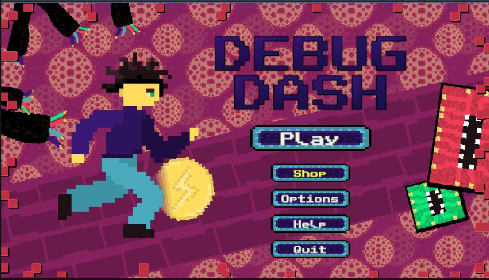

# Debug Dash

# Mūsų projekto komandos nariai
Kauno Technologijos Universiteto Informatikos fakulteto studentai:

- Požerskas Saulius
- Vilnius Martynas
- Arnas Šaltupis
- Paulauskis Deividas

# Projekto aprašymas
Debug Dash yra 2D begalinio bėgimo žanro žaidimas, kuriame žaidėjo tikslas yra išgyventi kuo įmanoma ilgesnį laiką neatsitrenkiant į kliūtį, bent vienas atsitrenkimas į kliūtį reiškia automatinę žaidėjo mirtį. Žaidėjas žadimo metu taip pat renka bonusus, kurie padeda jam ilgiau išgyventi ir auksines monetas kurias galima keisti į prekes žaidimo parduotuvėje. Žaidimo sudėtingumas didėja bėgant laikui.

# Techninis aprašymas

Žaidimas buvo sukurtas pasinaudojus Unity žaidimų kūrimo įrankių. Projekto valdymui ir komandos darbui buvo pasitelktos priemonės: „JIRA“, „Discord“, „Unity Version Control“. Pasiekti pagrdindiniai techniniai tikslai žaidimo kūrimo metu (ne eilės tvarka):

- Sukurti begalinį takelio generavimą
- Suprogramuoti veikėjo UI
- Priskirti žaidimui muziką ir kitus garso efektus
- Priskirti žaidimui vaizdinius efektus, bėgimo, mirties, šuolio, pritūpimo animacijas
- Suprogramuoti Box Collider veikimo įpatumus su kliūtimis ir bonusais
- Sukurti veikėjų, kliūčių, bonusų vaizdus
- Suprogramuoti taškų skaičiavimo ir bonusų veikimo sistemą
- Suprogramuoti kliūčių ir bonusų atsitiktinį atsiradimą žaidimo metu
- Sukurti perėjimus tarp scenų
- Suteikti žaidimui arkadinį stilių
- Sukurti žaidimui parduotuvę
- Suprogramuoti prekių pirkimo sistemą ir jų realizacija
- Sukurti žaidimui pradini menių su įvairiomis funkcijomis
- Sukurti mygtukų dizainus
- Suprogramuoti mygtukų funkcionalumą

# Projekto testavimas

----

# Žaidimo taisyklės

Žaidimas pradedamas iš pradinio meniu lango paspaudžius „Play“. Po to pereinama į sceną kurioje žmogeliukas automatiškai jau bėga:

# Vartotojo dokumentacija
